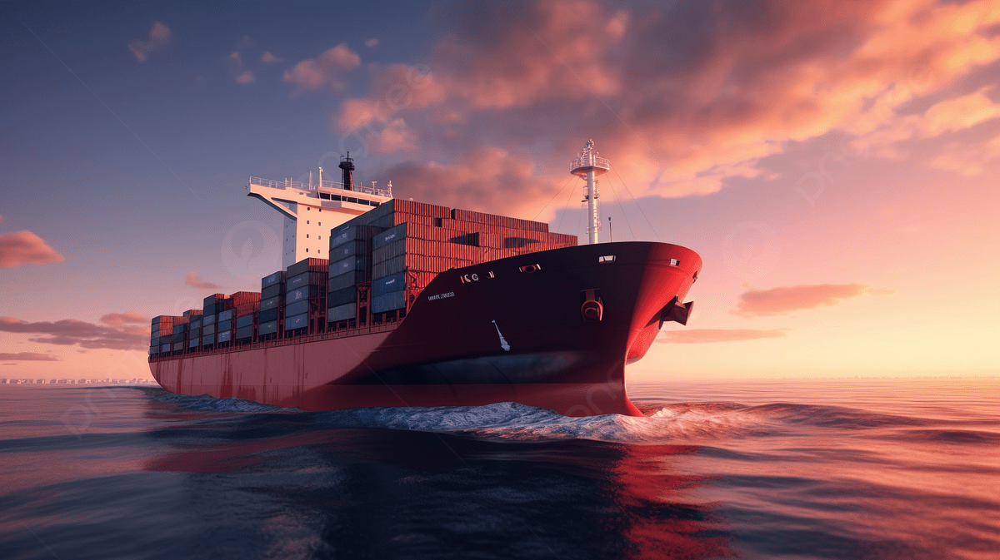

<h1 align="center"><b>JAL-Marg</b>

<p align="center">
  
</p>

</h1>

<p align="center">
  
</p>

---

## 🌊 Project Overview

**JAL-Marg** is an intelligent inland waterway management and route optimization platform built for the Indian shipping ecosystem. It aims to enhance the safety, efficiency, and sustainability of marine cargo transport.

---

## 📌 Background

Shipping remains the primary mode of transporting goods globally, but it heavily depends on fossil fuels. This leads to rising fuel costs and environmental concerns. Hence, optimizing ship routes for **fuel efficiency**, **time**, **safety**, and **passenger comfort** becomes critical.

A route optimized purely for energy efficiency may not always be safe due to unpredictable weather. So, a balance of multiple parameters is necessary to prevent loss of cargo, life, or ship damage.

> An ideal solution would be an application that suggests **optimal voyage routes** between ports in the **Indian Ocean**, factoring in safety, time, and efficiency.

---

## 🧠 Description

At the core of **JAL-Marg** is a powerful **optimization algorithm**. Though many algorithms exist in literature, no open-source or public tools currently address **Indian Ocean-specific routing** with such customizable parameters.

Key parameters include:
- 🌬️ Wind forces
- 🌊 Ocean currents and waves
- 🛳️ Ship design and drift behavior

The challenge lies in building a **dynamic algorithm** that:
- Continuously evolves based on weather forecasts
- Optimizes routes for a wide range of vessels
- Returns the best route in reasonable time

---
---

## 🚧 Project Status

> **JAL-Marg** is currently a work in progress.  
> Some features are under development and may be incomplete or subject to change.  
> Contributions, suggestions, and feedback are welcome!

---


## 🧪 Expected Solution

- ✅ Identify a **versatile and scalable optimization method**
- 🚀 Implement the solution in **Python**
- 🔁 Ensure support for real-time **weather and sea data updates**
- 📊 Add support for more parameters (e.g., cost, emissions, port congestion) in the future

---

## 🎥 Related Reference Videos

- 🔗 [Introduction to Ship Route Optimization](https://www.youtube.com/watch?v=ct9v-mQgYqE)  
- 🔗 [Visualization of Ship Routing Challenges](https://www.youtube.com/watch?v=wCTdHRTWtNI)

---

## 🧰 Tech Stack (for Implementation)

| Layer        | Technology       |
|--------------|------------------|
| Frontend     | React + Tailwind CSS |
| Backend      | Node.js / Express |
| Data Sources | Weather APIs, Ship Databases |
| Algorithms   | Python (Optimization Libraries) |
| Mapping      | Mapbox / Leaflet |

---

## 👨‍💻 How to Run Locally

```bash
git clone https://github.com/AjinkyaxSuryawanshi/Jal-Marg.git
cd Jal-Marg
npm install
npm start
